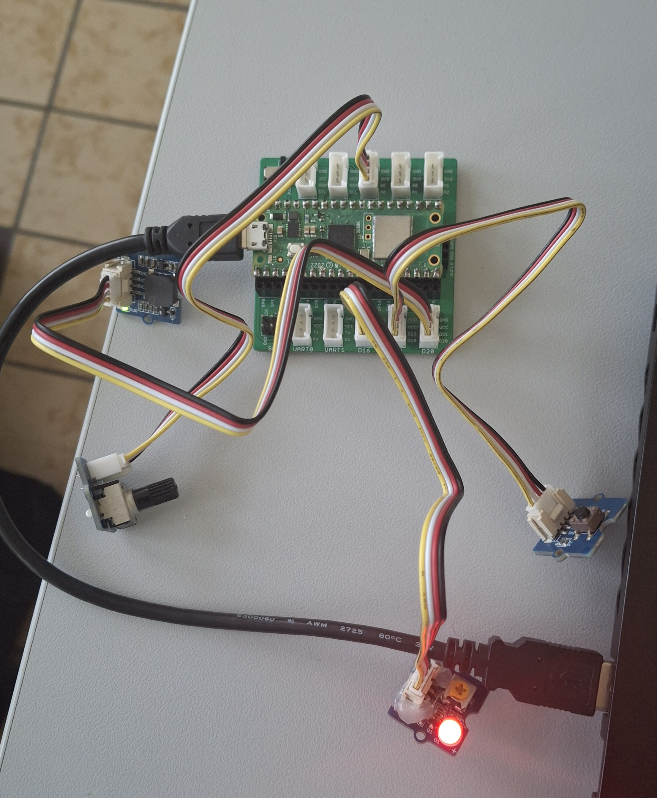

# AD-PWM – Potentiomètre, PWM et buzzer

Ce répertoire traite de deux notions du Raspberry Pi Pico W :

- la **conversion analogique-numérique** (ADC) : lire la position d'un **potentiomètre** ;
- la **modulation de largeur d'impulsion** (PWM) : produire un son sur un **buzzer** et en régler
  le volume.

Deux exercices sont réalisés :

1. **Volume du buzzer** : le buzzer siffle plus ou moins fort selon la rotation du potentiomètre.
2. **Volume d'une mélodie** : une mélodie est jouée en boucle et son volume est réglé en direct par
   le potentiomètre (bonus : bouton pour changer de mélodie et LED qui clignote au rythme des notes).

[⬅ Retour au README principal](../README.md)

---

## Sommaire

- [Matériel](#matériel)
- [Câblage](#câblage)
- [Notions de base](#notions-de-base)
  - [L'ADC : lire un potentiomètre](#ladc--lire-un-potentiomètre)
  - [Le PWM : piloter le buzzer](#le-pwm--piloter-le-buzzer)
- [Exercice 1 : volume du buzzer](#exercice-1--volume-du-buzzer)
- [Exercice 2 : volume d'une mélodie](#exercice-2--volume-dune-mélodie)
- [Test et dépannage](#test-et-dépannage)
- [Fichiers](#fichiers)

---

## Matériel

| Élément | Quantité |
|---|---|
| Raspberry Pi Pico W | 1 |
| Grove Shield for Pi Pico | 1 |
| Module potentiomètre Grove (*Rotary Angle Sensor*) | 1 |
| Module buzzer Grove | 1 |
| Module bouton-poussoir Grove (bonus exercice 2) | 1 |
| Module LED Grove (bonus exercice 2) | 1 |
| Câbles Grove (4 fils) | 4 |
| Câble micro-USB | 1 |

---

## Câblage



| Module | Connecteur du shield | Broche du Pico W | Utilisé dans |
|---|---|---|---|
| Potentiomètre | **A0** | GP26 (ADC0) | exercices 1 et 2 |
| Buzzer | **D20** | GP20 | exercices 1 et 2 |
| Bouton-poussoir | **D18** | GP18 | exercice 2 (bonus) |
| LED | **D16** | GP16 | exercice 2 (bonus) |


---

## Notions de base

### L'ADC : lire un potentiomètre

Un **potentiomètre** est une résistance variable : en tournant le bouton, on fait varier la tension
de sortie entre 0 V et 3,3 V.

Le Pico possède un **ADC** (convertisseur analogique-numérique) qui transforme cette tension en
nombre. En MicroPython, `read_u16()` renvoie une valeur entre **0** et **65535** :

| Position du potentiomètre | Tension | Valeur lue |
|---|---|---|
| Tourné à fond d'un côté | 0 V | 0 |
| Au milieu | 1,65 V | ≈ 32768 |
| Tourné à fond de l'autre côté | 3,3 V | 65535 |

```python
from machine import ADC, Pin

potentiometre = ADC(Pin(26))      # GP26 = A0
valeur = potentiometre.read_u16() # 0 à 65535
print(valeur * 100 // 65535, "%") # conversion en pourcentage
```

La valeur lue tremble légèrement à cause du bruit électrique. Les programmes font donc la
**moyenne de plusieurs lectures** pour obtenir une valeur stable.

### Le PWM : piloter le buzzer

Le **PWM** (*Pulse Width Modulation*) fait passer très rapidement une broche de 0 à 1 et de 1 à 0.
Deux réglages comptent :

| Réglage | Fonction MicroPython | Effet sur le buzzer |
|---|---|---|
| **Fréquence** : nombre de cycles par seconde | `buzzer.freq(440)` | la **hauteur** du son (grave ou aigu) |
| **Rapport cyclique** : part du temps où le signal vaut 1 | `buzzer.duty_u16(32768)` | le **volume** du son |

```
Rapport cyclique 10 %  (son faible)     Rapport cyclique 50 %  (son fort)
 _       _       _                       ____    ____    ____
| |_____| |_____| |_____                |    |__|    |__|    |__
```

`duty_u16()` accepte une valeur de 0 (0 %, silence) à 65535 (100 %). Le buzzer sonne le plus fort
à **50 %** (32768) : au-delà, le son ne devient pas plus fort. Le volume maximum est donc limité à
32768 dans les programmes.

```python
from machine import PWM, Pin

buzzer = PWM(Pin(20))
buzzer.freq(440)          # note LA (440 Hz)
buzzer.duty_u16(32768)    # volume maximum
buzzer.duty_u16(0)        # silence
```

### Une variation de volume plus naturelle

L'oreille ne perçoit pas le volume de façon linéaire : avec un calcul direct, le son devient fort
dès le premier quart de tour puis ne change presque plus. Les programmes utilisent donc une
**courbe au carré** :

```python
rapport = valeur / 65535                  # 0.0 à 1.0
volume = int(rapport * rapport * 32768)   # courbe au carré
```

| Position | Calcul linéaire | Courbe au carré |
|---|---|---|
| 25 % | 8192 | 2048 |
| 50 % | 16384 | 8192 |
| 75 % | 24576 | 18432 |
| 100 % | 32768 | 32768 |

La variation est ainsi répartie sur toute la rotation du potentiomètre.

---

## Exercice 1 : volume du buzzer

Fichier : [`buzzer_pot.py`](buzzer_pot.py)

### Objectif

Faire siffler le buzzer plus ou moins fort en fonction de la rotation du potentiomètre.

### Fonctionnement

1. Le buzzer produit un son de hauteur fixe (`FREQUENCE_SON = 2000` Hz).
2. Toutes les 20 ms, le programme lit le potentiomètre (moyenne de 8 lectures).
3. La valeur est convertie en rapport cyclique avec la courbe au carré.
4. En dessous de 3 % (`SEUIL_SILENCE`), le buzzer est complètement coupé.
5. Le pourcentage est affiché dans la console quand la position change.

### Arrêt propre

```python
except KeyboardInterrupt:
    buzzer.duty_u16(0)
    buzzer.deinit()
```

Quand on arrête le programme dans Thonny, le PWM continuerait à fonctionner et le buzzer sifflerait
encore. Ce bloc coupe le son à l'arrêt.

---

## Exercice 2 : volume d'une mélodie

Fichier : [`melodie_volume.py`](melodie_volume.py)

### Objectif

- Une mélodie est jouée **en boucle**.
- Le potentiomètre modifie **directement** le volume de la mélodie.
- Bonus : un **bouton** change de mélodie.
- Bonus : une **LED** clignote au rythme de la mélodie.

### Les notes

Chaque note correspond à une fréquence en hertz :

| Note | DO4 | RE4 | MI4 | FA4 | SOL4 | LA4 | SI4 | DO5 |
|---|---|---|---|---|---|---|---|---|
| Fréquence (Hz) | 262 | 294 | 330 | 349 | 392 | 440 | 494 | 523 |

Le chiffre indique l'octave : DO5 est le même DO que DO4, mais une octave plus aigu (fréquence
doublée). Le symbole `"-"` représente un silence.

La constante `TRANSPOSITION = 2` multiplie toutes les fréquences par 2 : la mélodie est jouée une
octave plus haut, car le buzzer sonne beaucoup plus fort dans l'aigu.

### Les durées

Chaque mélodie est une liste de couples `(note, durée)`. La durée est exprimée en **temps** :

| Nom en musique | Valeur dans le programme | Durée réelle (TEMPO = 120) |
|---|---|---|
| Croche | `0.5` | 250 ms |
| Noire | `1` | 500 ms |
| Blanche | `2` | 1000 ms |
| Ronde | `4` | 2000 ms |

En résumé : `1` = durée normale, `0.5` = deux fois plus court, `2` = deux fois plus long.

### Le tempo

Le **tempo** est la vitesse de la musique, exprimée en nombre de temps par minute (BPM). Avec
`TEMPO = 120`, il y a 120 temps par minute, soit 2 par seconde : un temps dure 0,5 s.

La durée réelle de chaque note est calculée par :

```python
duree_ms = int(duree * 60000 / TEMPO)
```

- `60000` : nombre de millisecondes dans une minute ;
- `60000 / TEMPO` : durée d'un temps (500 ms pour TEMPO = 120) ;
- `duree * ...` : durée de la note (une blanche `2` dure 2 × 500 = 1000 ms) ;
- `int(...)` : conversion en nombre entier.

Changer `TEMPO` accélère ou ralentit toute la mélodie sans modifier les notes.

### Les mélodies

| N° | Mélodie |
|---|---|
| 1 | Frère Jacques |
| 2 | Ode à la joie (Beethoven) |
| 3 | Au clair de la lune |
| 4 | Fanfare perso (mélodie inventée) |

Exemple de codage, le début de *Frère Jacques* :

```python
("DO4", 1), ("RE4", 1), ("MI4", 1), ("DO4", 1),   # Frè-re Jac-ques
("MI4", 1), ("FA4", 1), ("SOL4", 2),              # Dor-mez vous (« vous » est tenu 2 temps)
```

Pour ajouter une mélodie, il suffit d'ajouter une entrée dans la liste `MELODIES`.

### Un volume réglable pendant la note

Si chaque note était jouée avec `time.sleep()`, le potentiomètre ne serait lu qu'entre deux notes.
La fonction `attendre()` découpe donc chaque note en petits pas de **10 ms**. À chaque pas, elle :

1. relit le potentiomètre et met à jour le volume (`duty_u16`) ;
2. vérifie si le bouton a été appuyé.

```python
def attendre(duree_ms, son_actif):
    debut = time.ticks_ms()
    while time.ticks_diff(time.ticks_ms(), debut) < duree_ms:
        if son_actif:
            buzzer.duty_u16(lire_volume())
        if bouton_appuye():
            return True
        time.sleep_ms(10)
    return False
```

Le volume réagit ainsi immédiatement, même au milieu d'une note longue.

### Jouer une note

```python
buzzer.freq(frequence * TRANSPOSITION)   # choix de la note (hauteur)
led.on()                                 # LED allumée pendant la note
attendre(duree_ms - PAUSE_ENTRE_NOTES, True)
buzzer.duty_u16(0)                       # court silence pour détacher les notes
led.off()
attendre(PAUSE_ENTRE_NOTES, False)
```

Un silence de 40 ms sépare chaque note : sans lui, deux notes identiques qui se suivent (comme
« DO DO DO » dans *Au clair de la lune*) se confondraient en une seule note longue.

### Bonus

**Bouton (D18)** : un appui interrompt la mélodie en cours et passe directement à la suivante.
Après la dernière mélodie, on revient à la première. Un anti-rebond de 50 ms évite qu'un appui soit
compté plusieurs fois.

**LED (D16)** : elle s'allume pendant chaque note et s'éteint pendant le silence qui suit. Elle
clignote donc exactement au rythme de la mélodie.

### Réglages

| Constante | Rôle |
|---|---|
| `TEMPO` | vitesse de la mélodie |
| `TRANSPOSITION` | 1 = hauteur réelle, 2 = une octave plus aigu |
| `PAUSE_ENTRE_NOTES` | durée du silence entre deux notes (ms) |
| `PAUSE_FIN` | silence avant que la mélodie recommence (ms) |
| `VOLUME_MAX` | rapport cyclique maximum (32768 = 50 %) |
| `SEUIL_SILENCE` | pourcentage en dessous duquel le buzzer se tait |

---

## Test et dépannage

### Exercice 1

1. Lancer `buzzer_pot.py` dans Thonny.
2. Tourner le potentiomètre : le son augmente ou diminue, et le pourcentage s'affiche.
3. En butée basse, le buzzer est silencieux.

### Exercice 2

1. Lancer `melodie_volume.py` : *Frère Jacques* est jouée en boucle, la LED clignote.
2. Tourner le potentiomètre pendant la mélodie : le volume change immédiatement.
3. Appuyer sur le bouton : la mélodie suivante démarre et son nom s'affiche dans la console.

### Problèmes fréquents

| Problème | Cause probable | Solution |
|---|---|---|
| Le volume ne change pas | potentiomètre sur un connecteur D | le brancher sur **A0** |
| Aucun son | buzzer sur un autre connecteur | vérifier D20 ou modifier `PIN_BUZZER` |
| Le buzzer siffle encore après l'arrêt | programme arrêté brutalement | relancer puis arrêter avec Stop, ou débrancher le Pico |
| Le son est faible même au maximum | notes trop graves pour le buzzer | garder `TRANSPOSITION = 2` |
| Un appui saute plusieurs mélodies | rebonds du bouton | augmenter `ANTI_REBOND_MS` |

---

## Fichiers

| Fichier | Description |
|---|---|
| [`buzzer_pot.py`](buzzer_pot.py) | exercice 1 : volume du buzzer réglé par le potentiomètre |
| [`melodie_volume.py`](melodie_volume.py) | exercice 2 : mélodies en boucle, volume, bouton et LED |
| [`images/image_du_montage.jpg`](images/image_du_montage.jpg) | photo du montage |
| `README.md` | ce document |

[⬅ Retour au README principal](../README.md)
