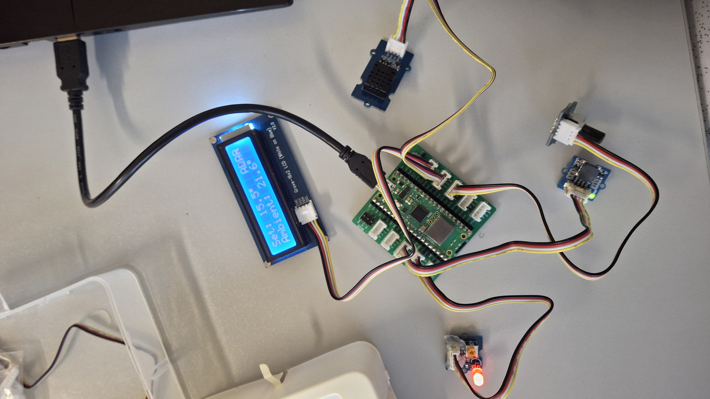

# Thermostat avec Raspberry Pi Pico

Ce projet est un thermostat réalisé en MicroPython sur une Raspberry Pi Pico W. On règle une température de consigne avec un potentiomètre, un capteur mesure la température de la pièce, et le système prévient l'utilisateur si la température devient trop élevée : la LED clignote, puis le buzzer sonne et le mot `ALARM` apparaît à l'écran.



## Contenu du dossier

```
Temperature/
├── README.md          ce fichier
├── temperature.py     programme principal
└── images/
    └── tcp.jpg        photo du montage
```

Le programme a aussi besoin de la bibliothèque `lcd1602.py`, qui doit être présente sur la Pico pour piloter l'écran.

## Matériel

- Raspberry Pi Pico W avec un Grove Shield for Pi Pico
- Écran LCD 16x2 Grove
- Capteur de température Grove DHT20
- Potentiomètre Grove
- LED Grove
- Buzzer Grove

## Branchements

| Module | Port Grove | Broches de la Pico |
|---|---|---|
| Potentiomètre | A0 | GP26 |
| Buzzer | D16 | GP16 |
| LED | D18 | GP18 |
| Écran LCD | I2C0 | SDA GP8, SCL GP9 |
| Capteur de température | I2C1 | SDA GP6, SCL GP7 |

L'interrupteur d'alimentation du shield doit être sur **3V3**. Il vaut mieux brancher tous les modules **avant** de mettre la Pico sous tension.

## Fonctionnement

### Réglage de la consigne

Le potentiomètre donne une valeur entre 0 et 65535, que le programme convertit en température entre 15 °C et 35 °C :

```
consigne = 15 + 20 × valeur / 65535
```

Au milieu de sa course, le potentiomètre donne donc environ 25 °C. La valeur est moyennée et arrondie au demi-degré pour qu'elle ne tremble pas à l'écran.

### Mesure de la température

Le capteur DHT20 est interrogé environ une fois par seconde. Si une lecture échoue, le programme garde la dernière valeur valide et affiche un message dans la console.

### Affichage

L'écran affiche deux lignes :

```
Set: 25.0°
Ambient: 23.4°
```

- `Set:` est la température de consigne.
- `Ambient:` est la température mesurée par le capteur.

### Les différents états

| État | Condition | LED | Buzzer | Écran |
|---|---|---|---|---|
| Normal | Température ≤ consigne | Éteinte | Silencieux | Consigne et température |
| Chaud | Température > consigne | Clignote lentement (0,5 Hz) | Silencieux | Consigne et température |
| Alarme | Température ≥ consigne + 3 °C | Clignote vite | Bips | `ALARM` en plus |

Exemple : si la pièce est à 22 °C, une consigne de 20 °C passe le système en état Chaud, et une consigne de 18 °C déclenche l'Alarme.

### Bonus réalisés

- **Battement progressif** : la LED s'allume et s'éteint en douceur au lieu de clignoter brutalement.
- **ALARM animé** : le mot peut rester fixe, clignoter ou défiler sur l'écran.

Ces options se règlent en haut de `temperature.py` :

```python
DIMMER = True              # False = clignotement simple
MODE_ALARME = "defile"     # "fixe", "clignote" ou "defile"
```

## Lancer le programme

1. Brancher la Pico à l'ordinateur et ouvrir **Thonny**.
2. Copier `temperature.py` et `lcd1602.py` sur la Pico.
3. Ouvrir `temperature.py` et cliquer sur **Exécuter**.
4. Tourner le potentiomètre pour changer la consigne et observer la réaction de la LED, du buzzer et de l'écran.

Pour que le thermostat démarre tout seul à la mise sous tension, enregistrer le programme sur la Pico sous le nom `main.py`.

## En cas de problème

| Problème | Solution |
|---|---|
| `Ambient: --.-` reste affiché | Vérifier que le capteur est bien sur le port I2C1 |
| L'écran reste vide | Vérifier le câble du port I2C0 et la présence de `lcd1602.py` sur la Pico |
| Erreur `NameError` au démarrage | Le début du fichier a été mal copié : vérifier les lignes `import` |
| Le buzzer grésille ou sonne faiblement | Mettre `BUZZER_ACTIF = True` dans le programme |
